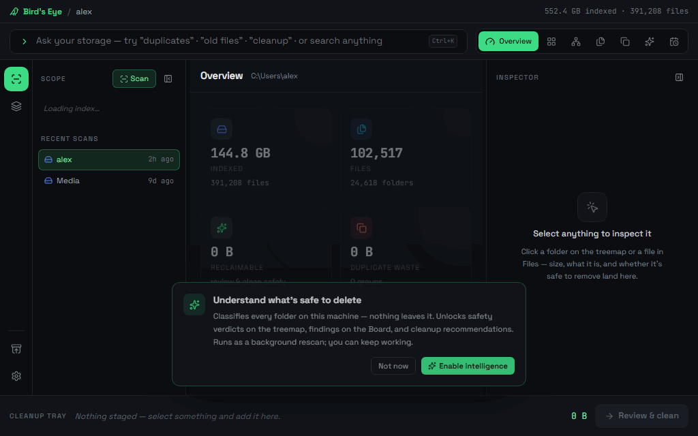

<div align="center">


# Bird's Eye

**Storage cognition for your own machine — not just _"what's big?"_ but _"what's safe to delete, and why?"_**

[](./LICENSE)
[](./src)
[](./src-tauri)
[](./workspace)



</div>

Bird's Eye is an offline desktop app that scans local folders into a persistent SQLite index,
then (optionally) runs an on-device **intelligence layer** that classifies every folder — why it
exists, whether it's regenerable, what depends on it — and turns that into safety verdicts,
reclaimable-space estimates, and a reviewed, reversible cleanup flow.

**Everything runs locally. Nothing ever leaves your machine.**

## Features

One persistent workspace — the top-bar switcher flips between views of the same index, never
"pages":

| View | What it gives you |
|---|---|
| **Overview** | The hub: capacity bar, category donut, top consumers, age snapshot, quick actions, and a headline — *"X GB can likely be freed"*. |
| **Treemap** | Squarified space map, colored by **type** or by **safety verdict** (safe / review / protected / keep), drillable to any depth. |
| **Board** | An open canvas of the investigation: findings cluster around shared-source hubs with labeled edges, duplicate groups link to related findings, and you can marquee-select, group-drag, and auto-arrange. |
| **Files** | Ranked search with category filters, size/date sorting, staleness tags, and curated saved views ("Large & regenerable", "Finished & untouched"). |
| **Duplicates** | Waste-ranked groups with side-by-side previews — keep the newest, stage the rest, or move a copy where it belongs. |
| **Cleanup** | Risk-labeled recommendations (safe / review / caution) with multi-select staging. |
| **Timeline** | Monthly activity, file-age distribution, and "large & untouched" candidates. |

Around every view: an **Inspector** (why it exists · composition · safety verdict), a **Cleanup
Tray** that collects from anywhere, and a **Review gate** that re-verifies before anything moves.
Files can also be **moved to a better home** instead of deleted — the index heals itself with a
background rescan.

## Safety model

- Nothing is deleted without an explicit review step; every clean goes to the **OS Recycle Bin**
  with a tracked entry, restorable for 30 days from **Recently cleaned** (or instantly via Undo).
- Items the safety predicate holds back are shown — never silently dropped — and *you* can still
  remove them through an explicit, clearly-marked override.
- The intelligence layer is **opt-in per index**, heuristic (no ML, no cloud), and shows its
  reasoning; unclassified means unclassified, never invented data.

## Getting started

Prereqs: [Rust](https://rustup.rs/), [Node 20+](https://nodejs.org/), and on Windows the
[Tauri 2 prerequisites](https://v2.tauri.app/start/prerequisites/).

```powershell
git clone https://github.com/keiken-shin/birds-eye.git
cd birds-eye/workspace
npm install
npm run tauri:dev        # dev desktop shell (vite + Rust backend)
npm run tauri:build:app  # release executable (no installer bundling)
```

The executable lands at `src-tauri/target/release/birds-eye-desktop.exe`. Full installer
bundling (`npm run tauri:build`) needs the WiX toolchain on Windows.

Frontend-only development works in a plain browser — `npm run dev` serves the workspace against
a deterministic mock backend with realistic fixture data.

## Verify

```powershell
cargo test                                        # Rust: scanner, index, ontology (190+ tests)
cargo check --manifest-path src-tauri\Cargo.toml  # desktop shell
cd workspace
npm run build                                     # tsc + vite
npx vitest run                                    # frontend unit tests
```

## Project layout

- `src/scanner/` — parallel filesystem scanner (cancellation, symlink-safe traversal).
- `src/index/` — SQLite schema, index writer, rollups, search, timeline/age aggregates,
  duplicate detection.
- `src/ontology/` — the intelligence layer: populators (heuristics, metadata extraction,
  perceptual-hash near-duplicates), discoveries, saved views, and the cleanup engine
  (plans → safety predicate → recycle-bin executor → restore).
- `src/native/` — Tauri-shaped DTOs and background job APIs.
- `src-tauri/` — desktop shell and Tauri commands.
- `workspace/` — the React 19 + Tailwind 4 frontend (`src/bridge/` is the typed Tauri bridge,
  `src/dev/` the browser-mode mock backend, `src/components/ui/` the design-system primitives).
- `docs/` — architecture notes, design comps (`docs/goal/`), the redesign rationale
  (`docs/reimagine.md`), and the ontology specs (`docs/superpowers/`).

## Contributing

Issues and PRs are welcome. A good change:

1. Keeps the safety model intact — no path to disk mutation that skips the review gate.
2. Keeps the gates green (`cargo test`, `npx tsc --noEmit`, `npx vitest run`, `npm run build`).
3. Uses the design tokens (`workspace/src/index.css`) and shared primitives
   (`workspace/src/components/ui/`) — no hardcoded colors, lucide icons only.

The browser mock backend (`workspace/src/dev/mockBackend.ts`) means most UI work needs no Rust
toolchain — `cd workspace && npm run dev` and go.

## Motivation

I have a scattered external storage drive, can't find what I need, and what I have. And it was a
trigger to my fake OCD too. Need to organize the drive but didn't know where to start. A live
visualizer turns that chaos into a clear battle plan. A start.

## License

MIT — see [LICENSE](./LICENSE).
