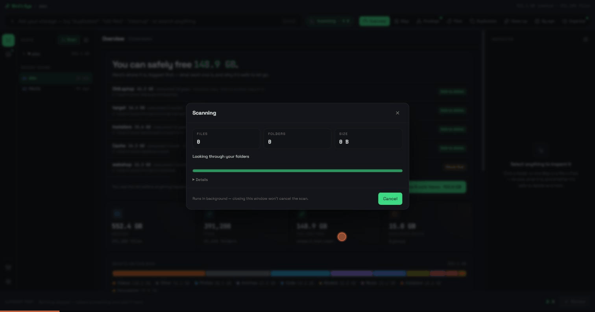

<div align="center">


# Bird's Eye — disk cleanup for Windows

**It tells you what's safe to delete, and why — not just what's big.**

[](./LICENSE)
[](./src)
[](./src-tauri)
[](./workspace)
[](https://birds-eye.keiken.dev/)

[**Get it from the Microsoft Store**](https://apps.microsoft.com/detail/9NZH5J31GHSL) ·
[**Download portable (.exe)**](https://github.com/keiken-shin/birds-eye/releases/latest/download/birds-eye-windows-portable-x64.exe) ·
[**Documentation**](https://birds-eye.keiken.dev/)

</div>

**Bird's Eye is a free, offline disk cleanup tool for Windows.**

It doesn't just show you what's big — it tells you what's safe to delete and why. Build caches,
installers you already ran, duplicate downloads, projects you finished two years ago: each one
gets a size, a last-touched date, and a plain-English reason.

Nothing is deleted until you review it. Everything goes to the Recycle Bin and stays restorable
for 30 days. Nothing is ever uploaded — no account, no telemetry, not a filename. MIT-licensed,
so read the code.



## What it finds

- Build outputs and package caches — `node_modules`, `target`, `.gradle`, pip
- Installers you already ran, sitting in Downloads
- Duplicate files, ranked by how much space they waste
- Projects you finished and haven't opened in a year
- Old backups, VM disks and model files you forgot about

Every one of them arrives with three things: **how much space it takes**, **how long since you
touched it**, and **a reason in plain English**.

```text
node_modules · 12.3 GB · untouched 8 months · rebuildable from package.json
```

## What it will never do

- No "health score." No "247 issues found."
- No registry cleaning. No startup "optimisation."
- No nagging, no countdowns, no upsell.
- No account, and no data leaving your machine.

There is no AI and no cloud in here. Bird's Eye reads your own folder structure and tells you
what it found.

## How long a scan takes

The first scan takes a few minutes, because it's reading more than sizes. After that it only
looks at what changed — so the second scan is seconds.

## Safety

- **Nothing is deleted until you review it.** You see a list of exactly what will happen, and
  Bird's Eye checks every item again before it moves anything.
- **Everything goes to the Recycle Bin**, restorable for 30 days from **Recently cleaned** — or
  undone instantly right after the action.
- **Moving a file gets the same review step.** Nothing moves until you confirm the plan, and a
  move can be undone right after it happens.
- **Things it won't touch are shown to you with the reason**, never silently dropped from the
  list — and you can still remove them yourself through an explicit, clearly-marked override.
- **Everything is labelled one of three ways**, and never a fourth:

| Label | Means |
|---|---|
| **Safe to delete** | Rebuildable, temporary, or a duplicate. |
| **Check first** | Might matter — here's what it is, you decide. |
| **Don't touch** | In use, system, or you pinned it — shown with the reason. |

- **The analysis just runs.** It's heuristic — no machine learning, no cloud, no external
  services — and it shows its reasoning for every recommendation. If it can't work out what
  something is, it says so instead of inventing an answer. If you only want sizes, there's an
  opt-out in Settings.

## The views

One workspace, one index. The top-bar switcher flips between views of the same scan (number
keys **1–8**) — never a page reload:

| View | What it gives you |
|---|---|
| **Overview** | Where you stand: capacity bar, what's taking the space, an age snapshot, and a headline — *"X GB can likely be freed"*. |
| **Map** | A space map where area is size, coloured by safety or by kind of file, drillable to any depth. |
| **Staged** | A durable decision desk for files and folders you set aside, group, and review for cleaning or moving. |
| **Files** | Ranked search with filters, size and date sorting, and saved views for the questions you ask every time — big files you can rebuild, projects you finished and haven't opened in a year. |
| **Duplicates** | Groups ranked by how much space they waste, with side-by-side previews — keep the newest, stage the rest, or move a copy where it belongs. |
| **Clean up** | Recommendations and findings waiting on a yes or no, each with a size, an age, a reason, and multi-select staging. |
| **By age** | Monthly activity, how old your files are, and the large-and-untouched items that are usually the easiest wins. |
| **Organise** | Grouped "these files belong somewhere else" suggestions, learned from where you already keep things, reviewed before anything moves. |

Around every view: an **Inspector** (what something is · what it's made of · whether it's safe
to remove), a **persistent tray** that collects from anywhere, and a **Review gate** that checks
the chosen items again before they move. Staged decisions survive an app restart. Files can also
be **moved to a better home** instead of deleted, and reviewed moves can be put back.

## Install

Install from the [**Microsoft Store**](https://apps.microsoft.com/detail/9NZH5J31GHSL)
(one click, auto-updating, signed), or download the
[**portable `.exe`**](https://github.com/keiken-shin/birds-eye/releases/latest/download/birds-eye-windows-portable-x64.exe)
from [GitHub Releases](https://github.com/keiken-shin/birds-eye/releases/latest) — Windows 10
& 11, x64. Full walkthrough:
[Getting started](https://birds-eye.keiken.dev/guide/getting-started/).

## Build from source

Prereqs: [Rust](https://rustup.rs/), [Node 20+](https://nodejs.org/), and on Windows the
[Tauri 2 prerequisites](https://v2.tauri.app/start/prerequisites/).

```powershell
git clone https://github.com/keiken-shin/birds-eye.git
cd birds-eye/workspace
npm install
npm run tauri:dev        # dev desktop shell (vite + Rust backend)
npm run tauri:build:app  # release executable (no installer bundling)
```

The executable lands at `src-tauri/target/release/birds-eye-desktop.exe`. Full installer
bundling (`npm run tauri:build`) needs the WiX toolchain on Windows.

Frontend-only development works in a plain browser — `npm run dev` serves the workspace against
a deterministic mock backend with realistic fixture data.

## Verify

```powershell
cargo test                                        # Rust: scanner, index, ontology (190+ tests)
cargo check --manifest-path src-tauri\Cargo.toml  # desktop shell
cd workspace
npm run build                                     # tsc + vite
npx vitest run                                    # frontend unit tests
```

## Project layout

- `src/scanner/` — parallel filesystem scanner. Symbolic links and junctions are never
  followed, so nothing is counted twice through one; hard links are counted once per name.
- `src/index/` — SQLite schema, index writer, rollups, search, timeline/age aggregates,
  duplicate detection.
- `src/ontology/` — the analysis: heuristic populators, metadata extraction, perceptual-hash
  near-duplicates, findings, saved views, and the cleanup engine (plans → safety predicate →
  recycle-bin executor → restore).
- `src/native/` — Tauri-shaped DTOs and background job APIs.
- `src-tauri/` — desktop shell and Tauri commands.
- `workspace/` — the React 19 + Tailwind 4 frontend (`src/bridge/` is the typed Tauri bridge,
  `src/dev/` the browser-mode mock backend, `src/components/ui/` the design-system primitives).
- `docs/` — the documentation site, published to
  [birds-eye.keiken.dev](https://birds-eye.keiken.dev/). Start with
  [Architecture](https://birds-eye.keiken.dev/develop/architecture/) for the
  developer tour.

## Contributing

Issues and PRs are welcome. A good change:

1. Keeps the safety model intact. Five commands can touch a file the user owns:
   `cleanup_plan` / `execute_cleanup_plan`, `relocation_plan` / `execute_relocation_plan`, and
   `trash_files`. The four plan commands are *structurally* gated — nothing moves or is removed
   except through a persisted plan that the backend re-verifies at execute time, and every one
   leaves a restore-log row. `trash_files` is the exception and worth naming: it takes paths
   directly, so its only gate is the review UI in front of it, and its undo is the Windows
   Recycle Bin rather than Recently cleaned. There is deliberately no raw "move these paths"
   command at all. Adding a sixth is a review topic, not a routine change.
2. Keeps the gates green (`cargo test`, `npx tsc --noEmit`, `npx vitest run`, `npm run build`).
3. Uses the design tokens (`workspace/src/index.css`) and shared primitives
   (`workspace/src/components/ui/`) — no hardcoded colors, lucide icons only.

The browser mock backend (`workspace/src/dev/mockBackend.ts`) means most UI work needs no Rust
toolchain — `cd workspace && npm run dev` and go.

## Motivation

I have a scattered external storage drive, can't find what I need, and what I have. And it was a
trigger to my fake OCD too. Need to organize the drive but didn't know where to start. A live
visualizer turns that chaos into a clear battle plan. A start.

## License

MIT — see [LICENSE](./LICENSE).
