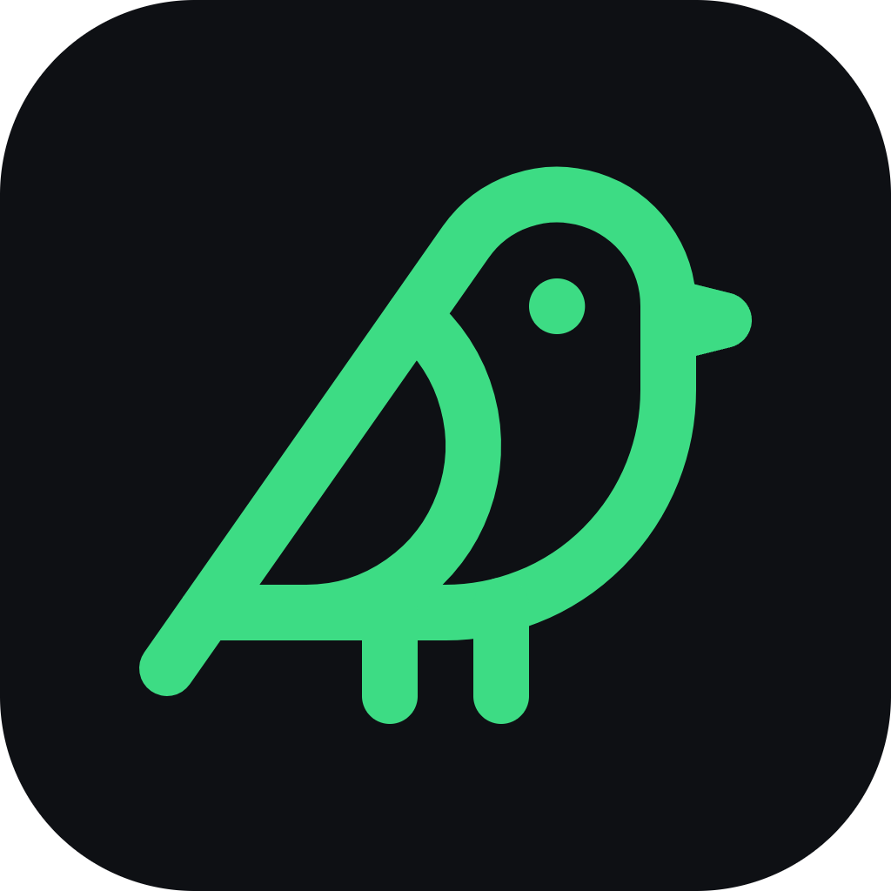

# Brand

Bird's Eye looks and sounds like the thing it is: a calm, precise instrument for your own
machine. Dark like the app, quantified like the data, and never alarmist. This page is the
reference for anyone building UI, docs, or marketing around it.

## The one idea

> **Other tools show you what's big. Bird's Eye tells you what's safe.**

Everything else on this page serves that sentence. If a headline, a label or a screenshot
doesn't move a reader closer to it, it's decoration.

Always pair the name with the noun — **"Bird's Eye — disk cleanup for Windows"** — in every
page title, store field, description and social bio. The name is memorable but it doesn't say
what the product does, and no brand name has to; that's the tagline's job.

## The three pillars

Three claims, in this order, and nothing else above the fold. Each one has a proof, and the
proof is what you show — never the claim on its own.

### 1 · It explains itself

Every recommendation carries three things: **how much space**, **how long since you touched
it**, and **a reason in plain English**.

**Show:** a real row, not the map.

```text
node_modules · 12.3 GB · untouched 8 months · rebuildable from package.json
```

### 2 · It can't hurt you

Nothing is deleted until you review a list of exactly what will happen. Everything goes to the
**Recycle Bin**, restorable for 30 days. Things it won't touch are shown with the reason, not
silently hidden.

**Show:** the review screen, and one held-back item with its reason visible.

### 3 · It never phones home

**No account. No telemetry. Nothing uploaded — not a filename, not a hash.** It works with the
network off. MIT-licensed, so you can check rather than believe.

**Show:** "works offline" as a demonstrable fact, plus the source link. This is the strongest
line available in a category with two FTC settlements and a shipped-malware incident behind it.
It gets its own line and its own weight — never ranked equal with an inward-facing stat like a
test count.

The line that does the most work for a technical reader:

> **No AI. No cloud. It reads your own folder structure and tells you what it found.**

In 2026 that's a differentiator, not an apology. Never put "AI" in a tagline.

## The mark

The logo is a single-stroke **bird** in spring green on a near-black tile — a lucide-family
glyph, drawn with rounded joins.



- Use the green bird on a dark surface. Keep clear space around it equal to the width of
  its shortest stroke.
- Don't recolor it, add gradients, rotate it, or place it on a busy background.
- The favicon and in-app mark are the same glyph — one bird, everywhere.

## Color

A near-black neutral ramp carries the interface; a single **spring green** is the only
brand accent. Meaning is layered on with two small, fixed palettes — one for the **safety
labels**, one for **media categories**. Everything comes from tokens in
`workspace/src/index.css` — never hardcode a literal.

### Core

<div style="display:flex;flex-wrap:wrap;gap:10px;margin:1rem 0">
  <span style="display:inline-flex;align-items:center;gap:8px"><span style="width:22px;height:22px;border-radius:5px;background:#0a0b0d;border:1px solid #1e2128"></span><code>#0a0b0d</code> base</span>
  <span style="display:inline-flex;align-items:center;gap:8px"><span style="width:22px;height:22px;border-radius:5px;background:#0e1014;border:1px solid #1e2128"></span><code>#0e1014</code> window</span>
  <span style="display:inline-flex;align-items:center;gap:8px"><span style="width:22px;height:22px;border-radius:5px;background:#191c22;border:1px solid #1e2128"></span><code>#191c22</code> raised</span>
  <span style="display:inline-flex;align-items:center;gap:8px"><span style="width:22px;height:22px;border-radius:5px;background:#3ddc84"></span><code>#3ddc84</code> primary</span>
  <span style="display:inline-flex;align-items:center;gap:8px"><span style="width:22px;height:22px;border-radius:5px;background:#e6e8ea"></span><code>#e6e8ea</code> ink</span>
  <span style="display:inline-flex;align-items:center;gap:8px"><span style="width:22px;height:22px;border-radius:5px;background:#9aa0a8"></span><code>#9aa0a8</code> muted</span>
</div>

The spring green (`--color-primary: #3ddc84`) is used sparingly — for the primary verb,
active state, and links. On green, text is near-black (`#06140c`). Over-using the accent
kills its meaning; when everything is green, nothing is.

### The three safety labels

Three states, always paired with a size, an age and a reason. **There will never be a fourth** —
three is the ceiling for something a person has to read at a glance across hundreds of rows,
and every extra state is a legend they have to memorise.

| Label | Colour | Means | Internal verdict |
|---|---|---|---|
| <span style="display:inline-flex;align-items:center;gap:6px"><span style="width:14px;height:14px;border-radius:4px;background:#2f7d4e"></span>**Safe to delete**</span> | green | Rebuildable, temporary, or a duplicate. | `safe` |
| <span style="display:inline-flex;align-items:center;gap:6px"><span style="width:14px;height:14px;border-radius:4px;background:#6b5630"></span>**Check first**</span> | amber | Might matter — here's what it is, you decide. | `review` |
| <span style="display:inline-flex;align-items:center;gap:6px"><span style="width:14px;height:14px;border-radius:4px;background:#2a2f38"></span>**Don't touch**</span> | grey, with the reason | In use, system, or you pinned it. | `protected` + `keep` |

`protected` and `keep` are separate in code and merge into one label in the UI. The difference —
"we won't let you" versus "we think you want this" — is ours, not the user's.

### Media categories

Nine kinds, each with its own hue — the second encoding channel next to the safety labels:

<div style="display:flex;flex-wrap:wrap;gap:10px;margin:0.75rem 0;font-size:0.85em">
  <span style="display:inline-flex;align-items:center;gap:6px"><span style="width:14px;height:14px;border-radius:4px;background:#d1651f"></span>video</span>
  <span style="display:inline-flex;align-items:center;gap:6px"><span style="width:14px;height:14px;border-radius:4px;background:#22a3c9"></span>photo</span>
  <span style="display:inline-flex;align-items:center;gap:6px"><span style="width:14px;height:14px;border-radius:4px;background:#d15590"></span>music</span>
  <span style="display:inline-flex;align-items:center;gap:6px"><span style="width:14px;height:14px;border-radius:4px;background:#bd8813"></span>document</span>
  <span style="display:inline-flex;align-items:center;gap:6px"><span style="width:14px;height:14px;border-radius:4px;background:#4b82e8"></span>code</span>
  <span style="display:inline-flex;align-items:center;gap:6px"><span style="width:14px;height:14px;border-radius:4px;background:#9177ee"></span>archive</span>
  <span style="display:inline-flex;align-items:center;gap:6px"><span style="width:14px;height:14px;border-radius:4px;background:#7f8c1a"></span>model</span>
  <span style="display:inline-flex;align-items:center;gap:6px"><span style="width:14px;height:14px;border-radius:4px;background:#d0544a"></span>installer</span>
  <span style="display:inline-flex;align-items:center;gap:6px"><span style="width:14px;height:14px;border-radius:4px;background:#5f6672"></span>other</span>
</div>

## Typography

Two typefaces, both bundled via `@fontsource` so the app is fully offline.

- **Space Grotesk** — UI and display. Headings, labels, body.
- **JetBrains Mono** — every **number, path, and size**. If it's data, it's monospace.

That split is a rule, not a suggestion: quantities in mono make the interface read as
measured and trustworthy.

## Iconography

**lucide** icons, everywhere. No emoji, no unicode glyph soup, no mixed icon sets. The bird
mark itself is from the same family.

## Voice & tone

Calm, quantified, and never alarmist. Bird's Eye is an analyst, not a salesperson.

**The one durable test: would you say this sentence out loud to a friend?** "Trust every
verdict" — no. "It tells you what's safe to delete and why" — yes. Run every new string
through it.

- **Quantify everything.** Every recommendation pairs a **size** + **how long since you
  touched it** + **a reason**. Never "clean up junk" — always "12.4 GB of build cache,
  untouched 8 months."
- **Give the number, never the category.** "Untouched 8 months," not "stale." The number is
  the argument.
- **Name real files.** Say `node_modules`, `target`, `.gradle`, "installers you already ran,"
  "a project you finished in 2023." Abstract nouns — folders, categories, candidates — prove
  nothing and could describe any tool in the category.
- **Concrete nouns, never technical vocabulary.** `node_modules` is a thing; `ontology
  populator` is vocabulary. One invites, the other excludes. A non-technical reader must not
  hit a single word they don't know.
- **Never manufacture urgency.** No countdowns, no red badges, no "your PC is at risk." The
  data is the argument.
- **Keep the trust copy.** These lines earn their place on screen: *"Recycle Bin first,"*
  *"restorable 30 days,"* *"nothing leaves your PC."*
- **Say what you don't know.** *Unclassified* is an honest answer. Don't invent a purpose
  or a confidence the app doesn't have.

When in doubt, write it the way you'd want a careful colleague to explain what's about to
happen to your files.

### Say this, not that

If the word came from a file name in `src/`, it does not belong in front of a user. The
engineering words are correct and they stay in the code and the developer docs — they just
never reach a label, a tooltip, a heading or a page.

| Say this | Not this |
|---|---|
| *(cut it entirely)* | `storage cognition` |
| what's safe to delete | `safety verdict` |
| space you can free · GB you'd get back | `reclaimable space` · `potential bytes unlocked` |
| untouched for 8 months | `staleness` · `stale` |
| the analysis · what Bird's Eye found | `the intelligence layer` · `opt-in per index` |
| findings | `discoveries` |
| *(never user-facing)* | `ontology` · `populator` · `predicate` · `entity` · `graduation` |
| a rebuildable build cache | `a regenerable artifact` |
| it works offline · nothing is uploaded | `fully offline, no telemetry paths in the code` |
| Bird's Eye checks before it moves anything | `the review gate re-verifies against the index` |
| put files where they belong | `cataloging` · `relocation suggestions` · `learned homes` |
| *(keep in the developer docs)* | `190+ Rust tests` · `8 views` · `one persistent index` |

## What we say we're not

Saying it out loud is the cheapest credibility available in a category with two FTC settlements
behind it. **This belongs on the homepage as a claim, not just in here as a rule.**

- **No "health score." No "247 issues found."** No counter, no red badge. That mechanic is the
  category's persuasion grammar and it's the thing the FTC sued over. One counter and we're
  indistinguishable from what we're positioned against.
- **No registry cleaning. No startup "optimisation."** Not a PC optimiser.
- **No nagging, no countdowns, no upsell.** It never auto-deletes and never pushes a "clean
  now" button.
- **No account, and no data leaving the machine.**
- **Not the fastest scanner, and we never claim to be.** The honest line, verbatim: *"The first
  scan takes a few minutes, because it's reading more than sizes. After that it only looks at
  what changed — so the second scan is seconds."* Never pick a fight with WizTree.
- **Not an AI product.** See pillar 3.
- **Organise is never the headline.** Space sells; tidiness upsells. Cleaning up stays the
  promise; Organise is what people find once they're already inside.
