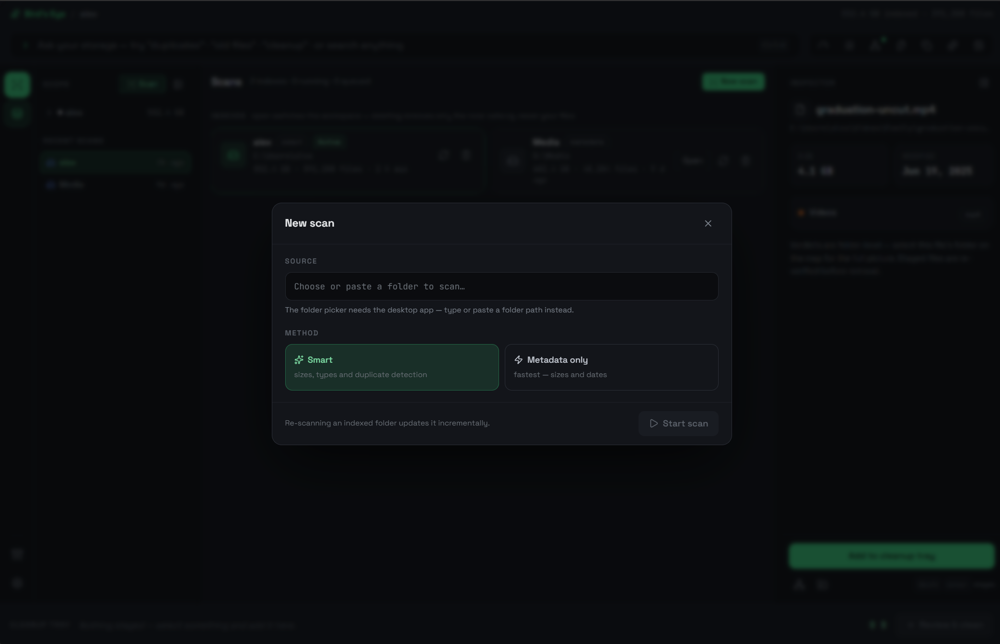
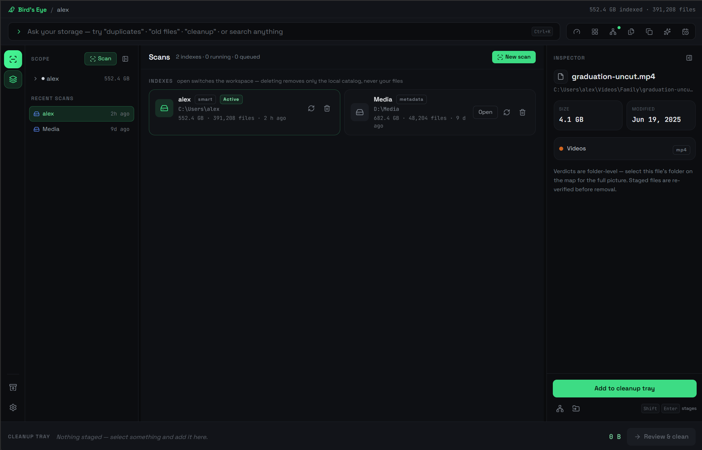

# Getting started

Bird's Eye is a Windows desktop app. It scans folders you point it at, indexes them on
your machine, and helps you reclaim space without ever putting a file beyond recovery.

## Install

=== "Microsoft Store (recommended)"

    Install from the [**Microsoft Store**](https://apps.microsoft.com/detail/9NZH5J31GHSL) —
    one click, automatic updates, and a signed package. Then launch **Bird's Eye**.

=== "Portable build"

    Prefer a no-install download? Grab the
    [**portable `.exe`**](https://github.com/keiken-shin/birds-eye/releases/latest/download/birds-eye-windows-portable-x64.exe)
    from the [latest release](https://github.com/keiken-shin/birds-eye/releases/latest) and
    run it. No installer wizard, no account.

=== "Build from source"

    Prefer to compile it yourself? Follow
    [Building from source](../develop/building.md). You'll need Rust, Node 20+, and the
    Tauri prerequisites; the whole thing builds to a single executable.

!!! info "System requirements"
    Windows 10 or 11 (x64). Bird's Eye runs fully offline and needs no network access at
    any point.

## Run your first scan

1. Click **New scan** in the left dock — the one prominent verb in the interface.
2. Pick a folder or drive to index. External drives, media archives, and cluttered
   project directories are where Bird's Eye earns its keep.
3. Watch it work. The scanner streams progress live; you don't have to wait for it to
   finish before the **Overview** starts filling in.

<figure markdown="span">
  { .be-shot }
  <figcaption>Starting a new scan — point Bird's Eye at a folder or drive.</figcaption>
</figure>

The scan writes to a persistent SQLite index, so it's there next time you open the app.
Re-scanning is **incremental** — unchanged files are skipped, so a second look is quick.
**Scans** is a stage of its own — the running scan, the queue, and index management all
live there.

<figure markdown="span">
  { .be-shot }
  <figcaption>Scans — track the running scan and queue, and manage saved indexes.</figcaption>
</figure>

## Read the Overview

When the scan settles, the **Overview** greets you with a headline like
*“42 GB can likely be freed,”* a capacity bar, a category donut, and your top space
consumers. This is the map of where you stand before you touch anything.

From here, switch lenses with the top-bar view switcher (or number keys **1–7**) —
each is a different way of looking at the *same* index, never a page reload. See
[The workspace](the-workspace.md) for a tour of all seven.

## Turn on the intelligence layer

The safety verdicts and cleanup recommendations come from an **intelligence layer** that
you enable **per index** — it's opt-in by design. Once on, it classifies each folder
(what it is, whether it's regenerable, what depends on it) using on-device heuristics,
and attaches a verdict and a plain-language reason to every candidate.

It's entirely local and heuristic — no machine learning, no cloud, no guessing. If it
can't classify something, it says so rather than inventing an answer.

## Clean up — safely

Nothing leaves your disk without passing through a **Review gate**, and nothing is
destroyed outright:

- Stage candidates into the **Cleanup Tray** from any view.
- Review the batch — Bird's Eye re-verifies before anything moves.
- Confirm, and items go to the **OS Recycle Bin**, restorable for 30 days (or Undo
  instantly).

Prefer to keep a file but move it somewhere sensible? Bird's Eye can **relocate** it
instead of deleting, then heal the index with a background rescan.

The full model — verdicts, overrides, and what "reversible" guarantees — is in
[Working safely](working-safely.md).

## Try it in a browser first

Curious before you install? The frontend runs in a plain browser against a realistic
mock backend — no Rust toolchain needed. It's the same interface, driven by fixture data:

```powershell
cd birds-eye/workspace
npm install
npm run dev
```

This is also how contributors iterate on the UI. See
[Building from source](../develop/building.md).
