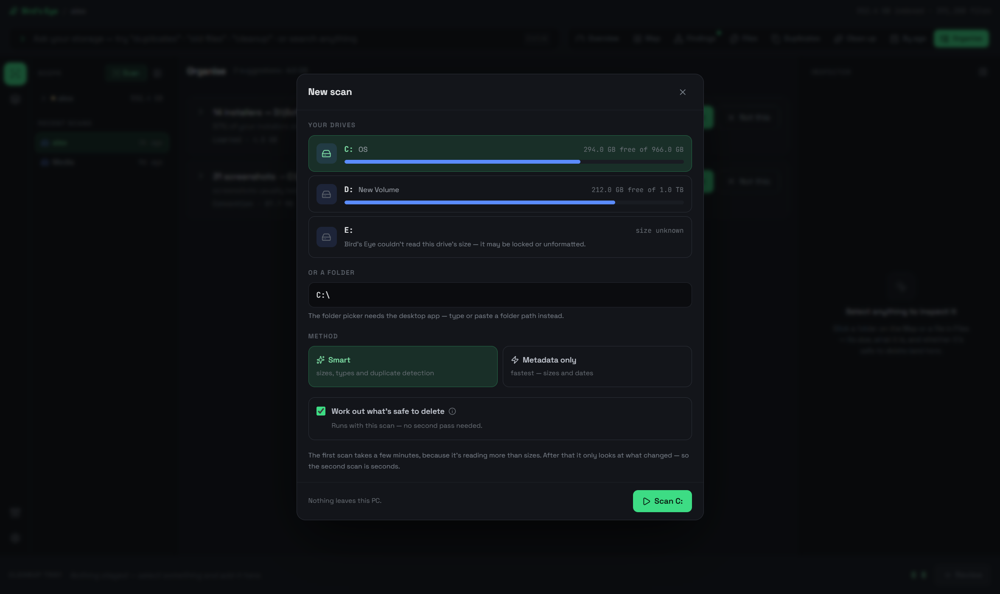
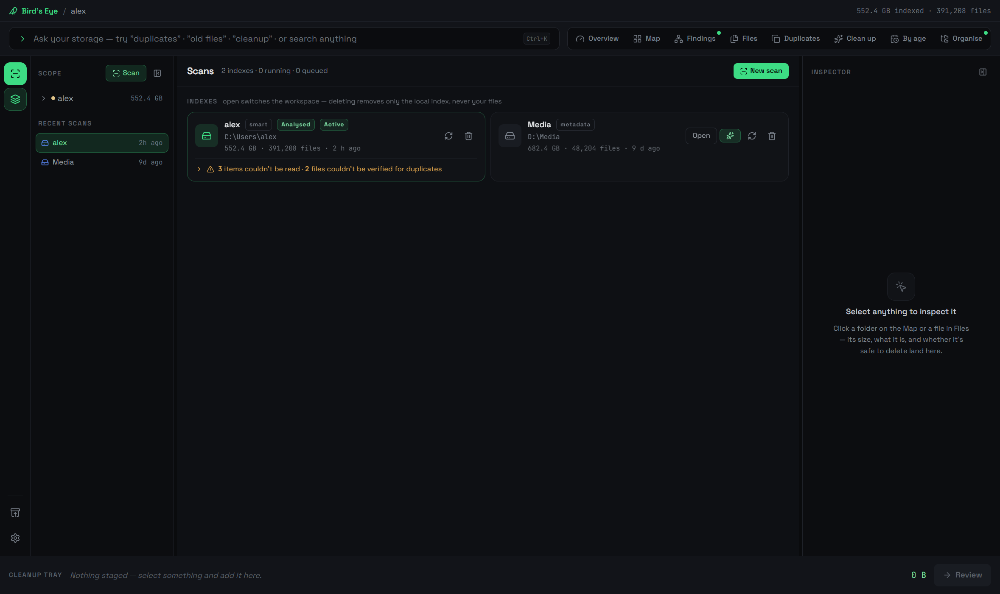
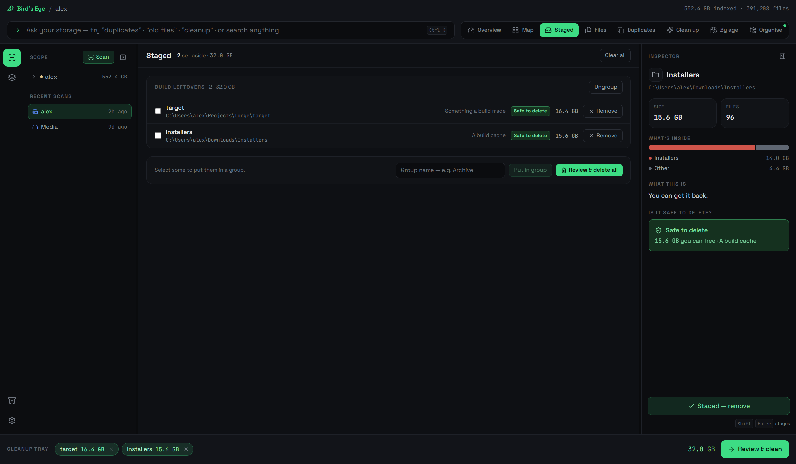

# Getting started

Bird's Eye is a free disk cleanup tool for Windows. You point it at a drive or a folder, it
works out what's on there, and it tells you what's safe to delete — with the size, the age and
the reason for each one. Nothing is deleted until you review it, and everything goes to the
Recycle Bin first.

## Install

**From the Microsoft Store (recommended).**
[Install it here](https://apps.microsoft.com/detail/9NZH5J31GHSL) — one click, automatic
updates, and a signed package. Then launch **Bird's Eye**.

**Or download the portable version.** Prefer no install? Grab the
[**portable `.exe`**](https://github.com/keiken-shin/birds-eye/releases/latest/download/birds-eye-windows-portable-x64.exe)
from the [latest release](https://github.com/keiken-shin/birds-eye/releases/latest) and run it.
No installer wizard, no account.

**Or build it yourself.** The whole thing compiles to a single executable — see
[Building from source](../develop/building.md).

!!! info "What you need"
    Windows 10 or 11 (x64). Local scans need no network or internet access, at any point;
    scanning a remote host uses whatever connection reaches it.

## Run your first scan

1. Click **New scan** in the left dock — the one prominent verb in the interface.
2. Pick a folder or drive. A cluttered projects folder, an external drive, or a media archive
   is where Bird's Eye earns its keep.
3. Watch it work. Results stream in as they're found, so the **Overview** starts filling in
   before the scan finishes.

<figure markdown="span">
  { .be-shot }
  <figcaption>Starting a scan — point Bird's Eye at a folder or drive.</figcaption>
</figure>

**The first scan takes a few minutes, because it's reading more than sizes.** After that it
only looks at what changed — so the second scan is seconds. Results are saved to your machine,
so they're still there next time you open the app. **Scans** has its own space in the app: the
running scan, the queue, and everything you've scanned before all live there.

<figure markdown="span">
  { .be-shot }
  <figcaption>Scans — track the running scan and queue, and manage what you've already scanned.</figcaption>
</figure>

## Remote hosts (SSH)

Scanning isn't limited to this machine. In **New scan**, flip the **Remote host (SSH)** toggle
to point Bird's Eye at a Linux machine instead — give it `user@host` and a folder, and it
streams the listing back over a single SSH session. Auth is key-based only (no password
prompts), and nothing is installed on the remote host. Connect to a new host once from a
terminal first, so its host key gets recorded — Bird's Eye never weakens host-key checking to
get a connection through.

Because Bird's Eye never copies the remote files, actions that touch a file directly —
**Reveal in Explorer**, preview, cleanup, **Move to folder…** — are only available for scans of
this machine. You can still stage what you find, so the list survives; the tray just won't act
on it. Duplicate detection still works: Bird's Eye runs a small, temporary script over that same
SSH session to hash files on the remote host, so only the hashes travel back — nothing is
installed and no file contents leave the host. Files over 64 MiB are matched by sampling, exactly
as on this PC. It needs Python 3 or Perl already on the remote host, which almost every host has;
one with neither gets a note in **Scans** instead.

## Read the Overview

When the scan settles, the **Overview** greets you with a headline like *"42 GB can likely be
freed,"* a capacity bar, a breakdown of what's taking the space, and your biggest folders. This
is where you stand before you touch anything.

From here, switch views with the top-bar switcher (or number keys **1–8**). Each one is a
different way of looking at the *same* scan, never a page reload. See
[The workspace](the-workspace.md) for a tour of all eight.

## What the analysis does

Bird's Eye doesn't just add up sizes. As it scans, it works out what each folder actually is —
a build cache, an installer you already ran, a duplicate download, a project you finished two
years ago — and that's where the recommendations, the labels and the reasons come from.

This runs on your PC, every time, with nothing to switch on. It's a set of rules, not machine
learning, and there's no cloud involved: no model ever sees your files. It shows its working
for every recommendation, and if it can't tell what something is, it says so rather than
inventing an answer.

If you'd rather just see sizes, you can turn the analysis off in **Settings**.

## Clean up — safely

Nothing leaves your disk without passing a **Review gate**, and nothing is destroyed outright:

- In **Clean up**, select a recommendation and choose **Stage selected**. You can also choose
  **Stage** in the Inspector, Files, Duplicates, or Map.
- Open **Staged** with the top switcher or the **3** key. The item stays there even if you close
  Bird's Eye; group it with related decisions or leave it loose.
- Choose **Review & clean**. Bird's Eye checks the chosen items again and shows you exactly what
  will happen.
- Confirm, and it goes to the **Recycle Bin** — restorable for 30 days, or undone instantly.

<figure markdown="span">
  { .be-shot }
  <figcaption>Staged is a durable decision desk. Setting something aside does not change the file.</figcaption>
</figure>

Prefer to keep a file but put it somewhere sensible? Bird's Eye can **move** it instead of
deleting it, then bring its records up to date with a background rescan. The **Organise** view
finds these for you — files sitting in Downloads, on the Desktop, or loose at the top of a
drive that look like they belong wherever you already keep similar ones.
