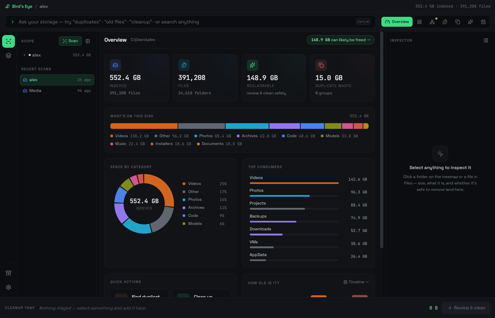
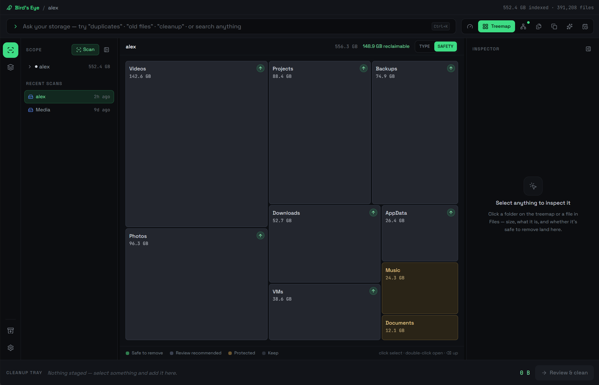
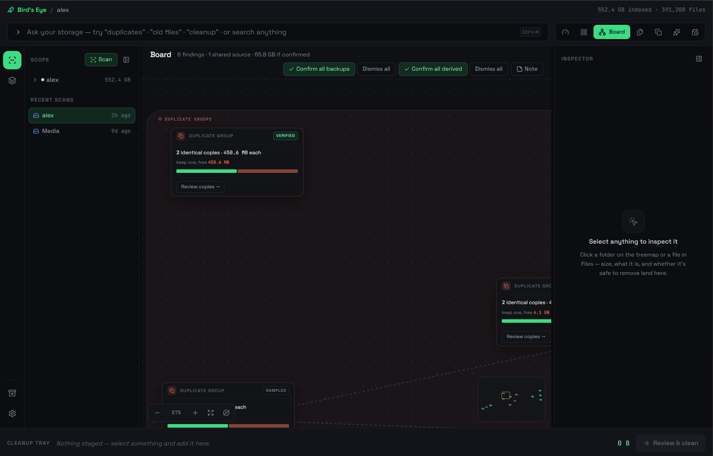
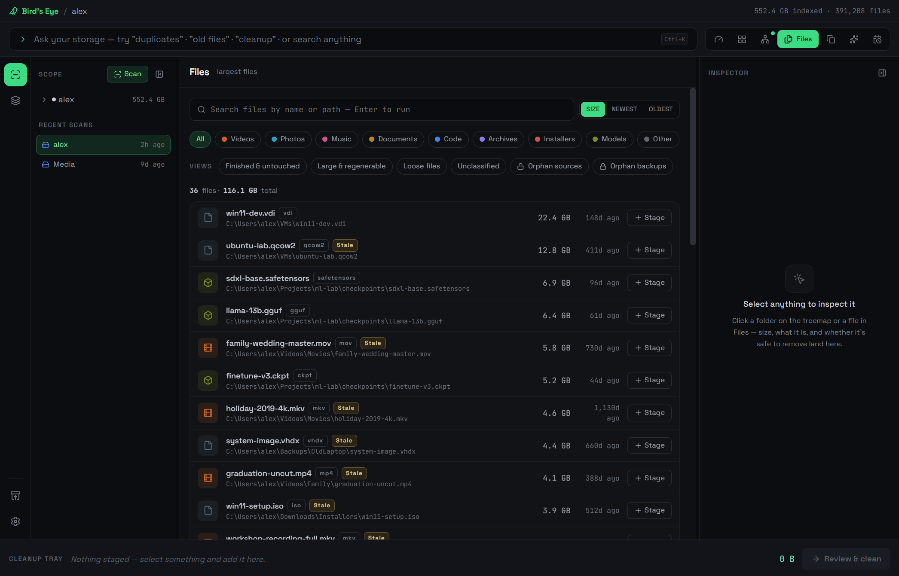
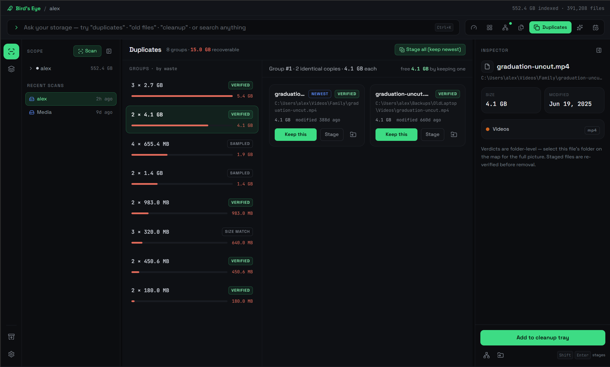
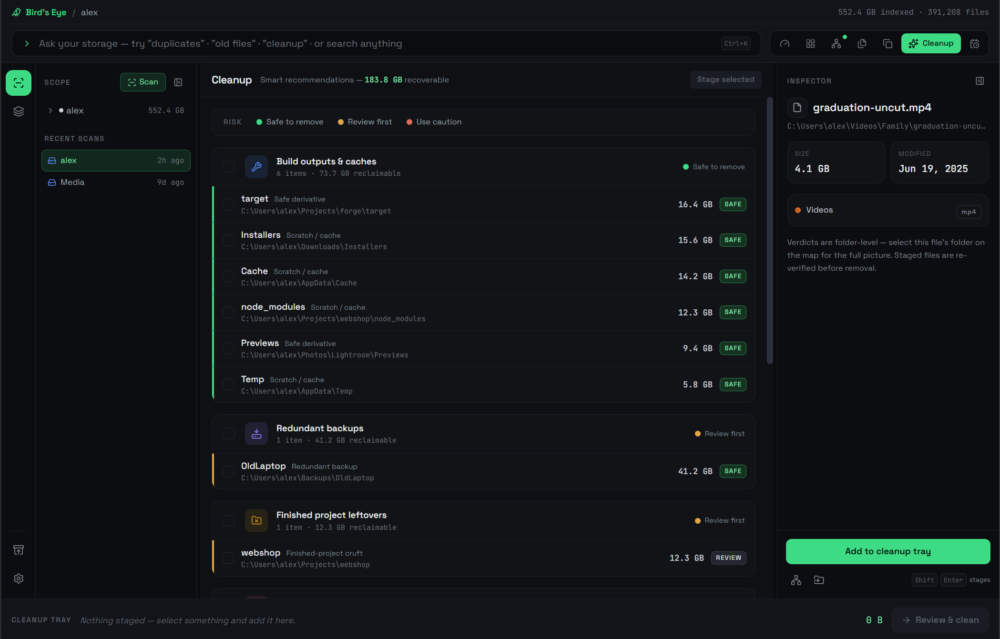
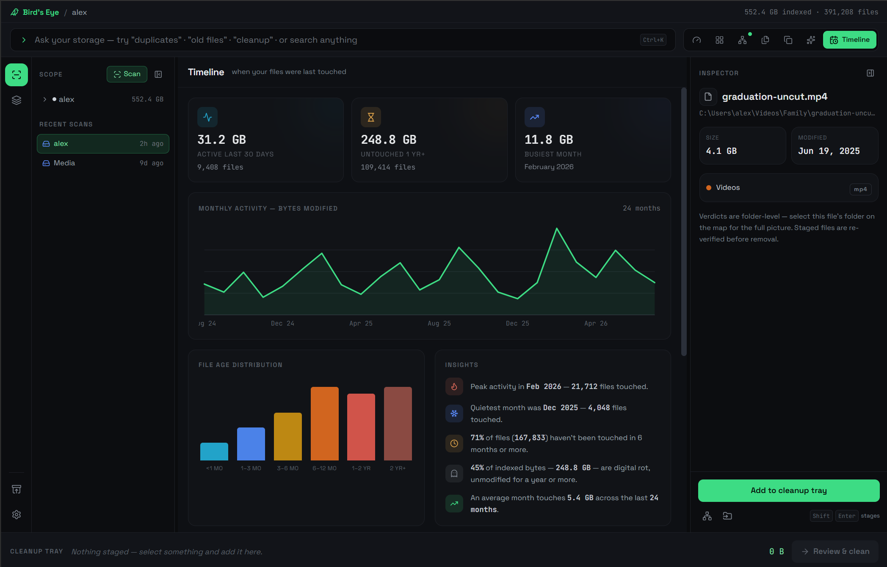

# The workspace

Bird's Eye is **one persistent workspace**, not a stack of pages. A single index sits
underneath, and the top-bar switcher flips between seven views of it. Three things travel
with you across every view:

- **The Inspector** — select anything and it explains *why it exists*, its composition,
  and its safety verdict.
- **The Cleanup Tray** — collects candidates from anywhere you find them.
- **The Review gate** — the one and only path to disk mutation. Tray → Review → Recycle
  Bin. Nothing skips it.

Switch views with the top-bar segments or number keys **1–7**. `Ctrl+I` toggles the
Inspector.

## 1 · Overview

The hub, and the default view. A capacity bar, a category donut, top consumers, an age
snapshot, quick actions, and a headline verdict — *“X GB can likely be freed.”* Start
here to see where you stand before changing anything.

<figure markdown="span">
  { .be-shot }
  <figcaption>The Overview — capacity, categories, top consumers, and the “can likely be freed” headline.</figcaption>
</figure>

## 2 · Treemap

A squarified space map where area is size. Color it by **type** (the nine media
categories) or by **safety verdict** —
safe
review
protected
keep — and drill to any depth. Small items
aggregate so the picture stays legible; layout order is stable, so the thing you spotted
last time is where you left it.

<figure markdown="span">
  { .be-shot }
  <figcaption>The Treemap — size as area, colored by category or safety verdict, drillable to any depth.</figcaption>
</figure>

## 3 · Board

A true open canvas of the investigation. Findings become typed cards that cluster around
shared-source hubs with labeled edges; duplicate groups link to related findings. Card
positions are stable, so spatial memory works — marquee-select, group-drag, auto-arrange,
and use the minimap and fit-to-view to navigate a large board.

<figure markdown="span">
  { .be-shot }
  <figcaption>The Board — an open canvas where findings cluster around shared-source hubs.</figcaption>
</figure>

## 4 · Files

Ranked search over the whole index: category chips, size bars, sort by size or date, and
staleness tags. Curated **saved views** — *“Large & regenerable,” “Finished & untouched”*
— turn common questions into one click, and a large-files preset gets you to the heavy
hitters immediately.

<figure markdown="span">
  { .be-shot }
  <figcaption>Files — ranked search with category chips, size bars, and curated saved views.</figcaption>
</figure>

## 5 · Duplicates

Duplicate detection, promoted from a modal to a first-class view. Groups are ranked by
**wasted space**, with side-by-side thumbnail comparison. Keep the newest and stage the
rest, or move a copy to where it actually belongs.

<figure markdown="span">
  { .be-shot }
  <figcaption>Duplicates — groups ranked by wasted space, with side-by-side comparison.</figcaption>
</figure>

## 6 · Cleanup

Risk-labeled recommendations — safe · review · caution — with multi-select staging
straight into the Cleanup Tray. Every recommendation pairs a **size**, a **staleness**,
and a **reason**, so you're never asked to trust a number without evidence.

<figure markdown="span">
  { .be-shot }
  <figcaption>Cleanup — risk-labeled recommendations, each with a size, a staleness, and a reason.</figcaption>
</figure>

## 7 · Timeline

How storage evolved and aged. A monthly activity chart, a file-age distribution, and
staleness insights like *“34% untouched 6+ months”* surface the *“large & untouched”*
candidates that are usually the easiest, safest wins.

<figure markdown="span">
  { .be-shot }
  <figcaption>Timeline — monthly activity, age distribution, and the “large & untouched” candidates.</figcaption>
</figure>

---

## Around every view

### Inspector

The persistent detail panel. For any folder or file it answers three questions: **why it
exists**, **what it's made of**, and **is it safe** — the same three the whole product is
organized around. Drag-resize it, or collapse it with `Ctrl+I`.

### Cleanup Tray

A staging area that follows you. Add candidates from the Overview, a treemap cell, a
search result, or a duplicate group — they all land in the same tray, ready for one
reviewed pass.

### Review gate

The single disk-mutating path. Before anything moves, the gate **re-verifies** the batch
against the current index, shows you exactly what will happen, and only then sends items
to the Recycle Bin. This is what makes "clean" safe to click. Details in
[Working safely](working-safely.md).
