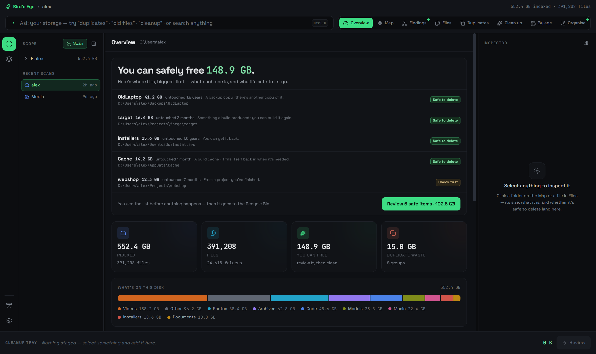
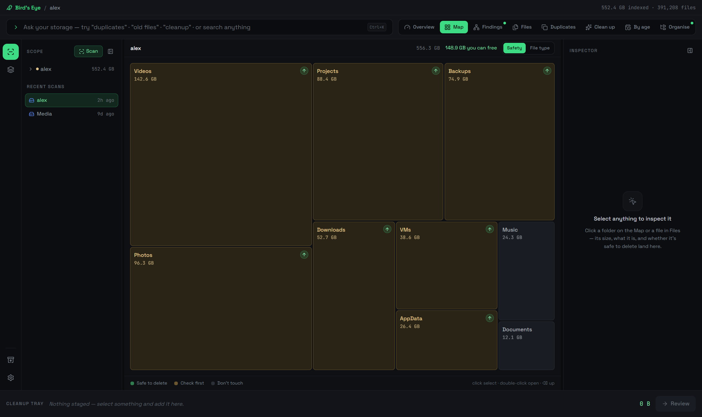
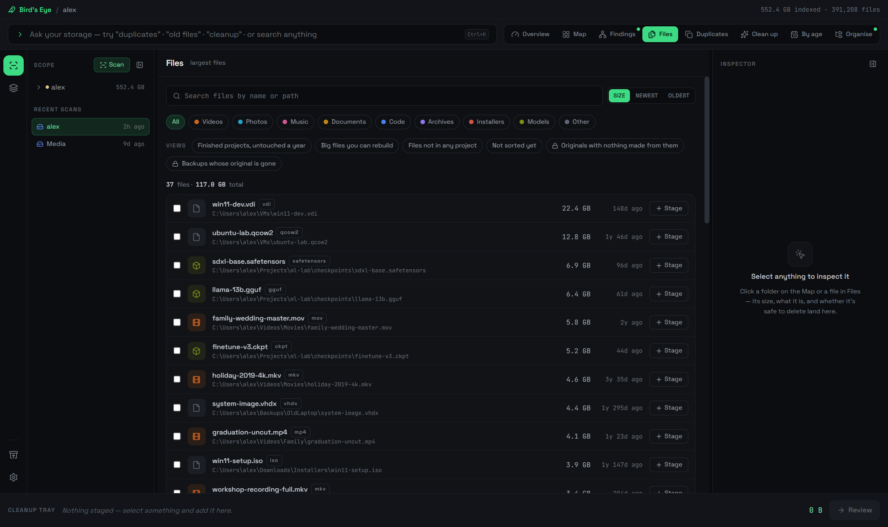
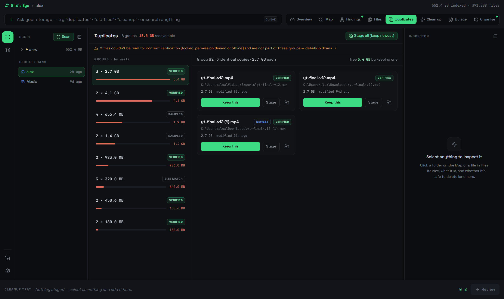
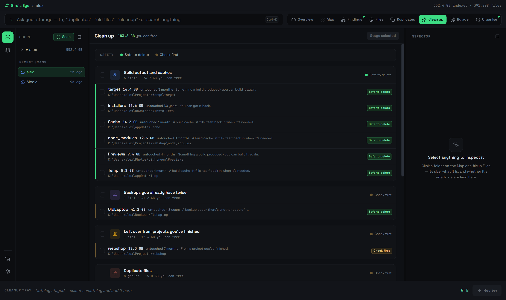
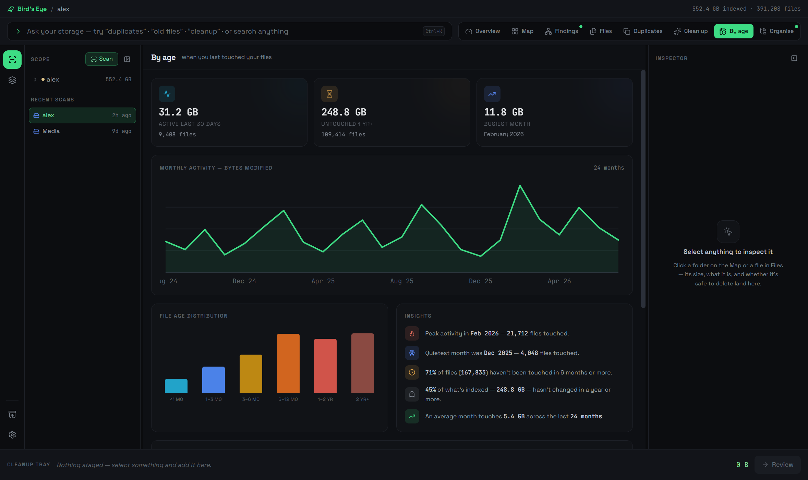
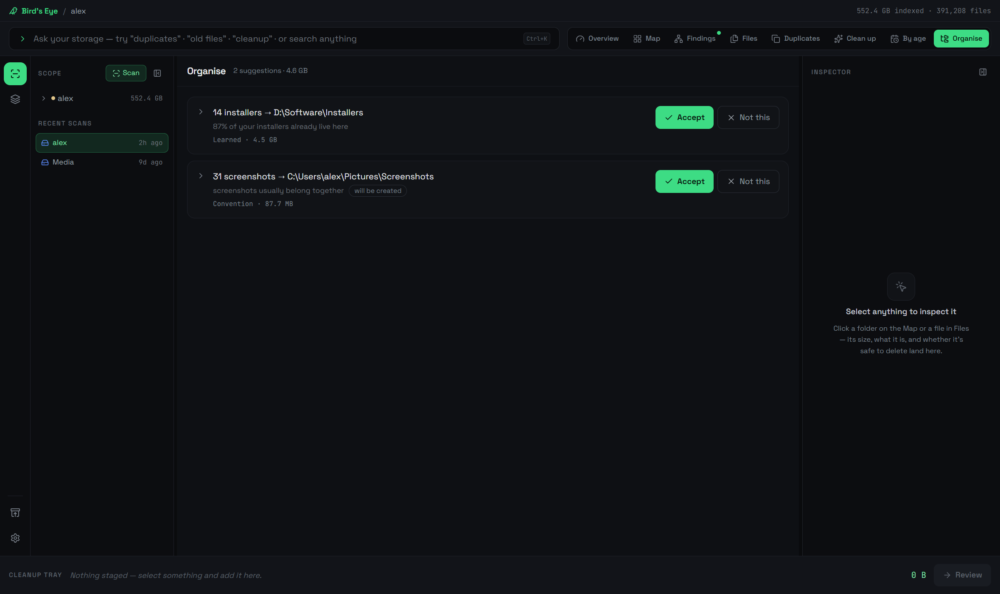

# The workspace

Bird's Eye is **one workspace**, not a stack of pages. A single scan sits underneath, and the
top-bar switcher flips between eight views of it. Three things travel with you across every
view:

- **The Inspector** — click anything and it tells you what it is, what it's made of, and
  whether it's safe to remove.
- **The persistent tray** — collects files and folders you stage for cleaning or moving, from
  wherever you found them. Its contents survive an app restart.
- **The Review gate** — the one and only path to your disk. Tray → Review → Recycle Bin, or the
  place you're moving a file to. Nothing skips it.

Switch views with the top-bar segments or number keys **1–8**. `Ctrl+I` opens and closes the
Inspector.

## 1 · Overview

The hub, and the view you land on. A capacity bar, a breakdown of what's taking the space, your
biggest folders, how old everything is, quick actions, and a headline — *"X GB can likely be
freed."* Start here to see where you stand before changing anything.

<figure markdown="span">
  { .be-shot }
  <figcaption>The Overview — capacity, what's taking the space, your biggest folders, and the "can likely be freed" headline.</figcaption>
</figure>

## 2 · Map

A space map where area is size. Colour it by **safety** — **Safe to delete**, **Check first**,
**Don't touch** — or by **kind of file**, and drill into any folder to any depth. Small items
are grouped together so the picture stays readable, and the layout is stable, so the thing you
spotted last time is where you left it.

<figure markdown="span">
  { .be-shot }
  <figcaption>The Map — size as area, coloured by safety or by kind of file, drillable to any depth.</figcaption>
</figure>

## 3 · Staged

The files and folders you set aside while deciding. Staging changes nothing on disk and survives
an app restart. Keep items loose or group related decisions, then review a selection—or the whole
desk—for cleaning or moving.

Staged deliberately has no To do / Doing / Done columns. It is a decision desk, not a project
manager, and every action still passes through Review.

<figure markdown="span">
  { .be-shot }
  <figcaption>Staged — persistent, groupable decisions with the size, reason, and safety label intact.</figcaption>
</figure>

## 4 · Files

Ranked search over everything you've scanned: filter by kind, sort by size or date, and see how
long each file has sat untouched. **Saved views** turn the questions you ask every time into
one click — big files you can rebuild from something else, files in projects you finished and
haven't opened in a year — and a large-files preset gets you straight to the heavy hitters.
Select several rows to move them together, and if the files you
moved share a name pattern, Bird's Eye offers to remember it so the same match is handled for
you next time.

<figure markdown="span">
  { .be-shot }
  <figcaption>Files — ranked search with filters, size bars, and saved views.</figcaption>
</figure>

## 5 · Duplicates

The same file, kept more than once. Groups are ranked by **how much space they waste**, with
the copies side by side so you can see they really are the same. Keep the newest and stage the
rest, or move a copy to where it actually belongs.

<figure markdown="span">
  { .be-shot }
  <figcaption>Duplicates — groups ranked by how much space they waste, with side-by-side comparison.</figcaption>
</figure>

## 6 · Clean up

The recommendations, in one list. Every row carries three things — **how much space**, **how
long since you touched it**, and **a reason in plain English** — and a label: **Safe to
delete**, **Check first**, or **Don't touch**. Select as many as you like and send them to the
tray in one go. You are never asked to trust a number without the reason next to it.

Findings that need a yes or no appear above the recommendation list. Confirming a relationship
can add the corresponding item to the list below, so the evidence and its consequence stay on
the same screen.

<figure markdown="span">
  { .be-shot }
  <figcaption>Clean up — every recommendation with a size, how long it's sat untouched, and a reason.</figcaption>
</figure>

## 7 · By age

What you've been using, and what you haven't. A month-by-month activity chart, a breakdown of
how old your files are, and lines like *"34% untouched 6+ months"* that lead you to the big,
forgotten items — usually the easiest and safest wins on the drive.

<figure markdown="span">
  { .be-shot }
  <figcaption>By age — monthly activity, how old your files are, and the large-and-untouched items.</figcaption>
</figure>

## 8 · Organise

Grouped suggestions for files that look like they belong somewhere else. Bird's Eye only looks
where things pile up — Downloads, the Desktop, the top level of a drive — and leaves folders
you've deliberately sorted alone. Each card proposes a destination, and tells you where the idea
came from: something you've taught it, wherever you already keep most files of that kind, or a
sensible fallback. Accept a card and its files go into the same tray as a cleanup; nothing moves
until you confirm it in review.

Organise needs the analysis to be running. If you've switched it off in **Settings**, this view
offers to turn it back on instead of showing an empty list.

<figure markdown="span">
  { .be-shot }
  <figcaption>Organise — grouped suggestions, each proposing a destination and saying where the idea came from.</figcaption>
</figure>

---

## Around every view

### Inspector

The detail panel that's always there. For any folder or file it answers three questions: **what
is this**, **what's in it**, and **is it safe to remove** — the same three the whole app is
organised around. Drag it wider, or close it with `Ctrl+I`.

### Persistent tray

A holding area that follows you around and survives an app restart. Add things from a Clean up
recommendation, a search result, a duplicate group, an old file in By age, or an Organise
suggestion — they all land in the same tray, ready for one reviewed pass. Anywhere without a
Stage button of its own, including the **Map** and the **Overview**, select the item and stage it
from the Inspector. Deletions and moves sit side by side, each reviewed on its own path.

### Review gate

The only way anything reaches your disk. Before it moves, the gate **checks the batch again**
against what's actually on the drive right now, shows you exactly what will happen, and only
then acts — sending things to the Recycle Bin, or moving them where an Organise suggestion
proposed. This is what makes "clean" (and "move") safe to click. Details in
[Working safely](working-safely.md).
