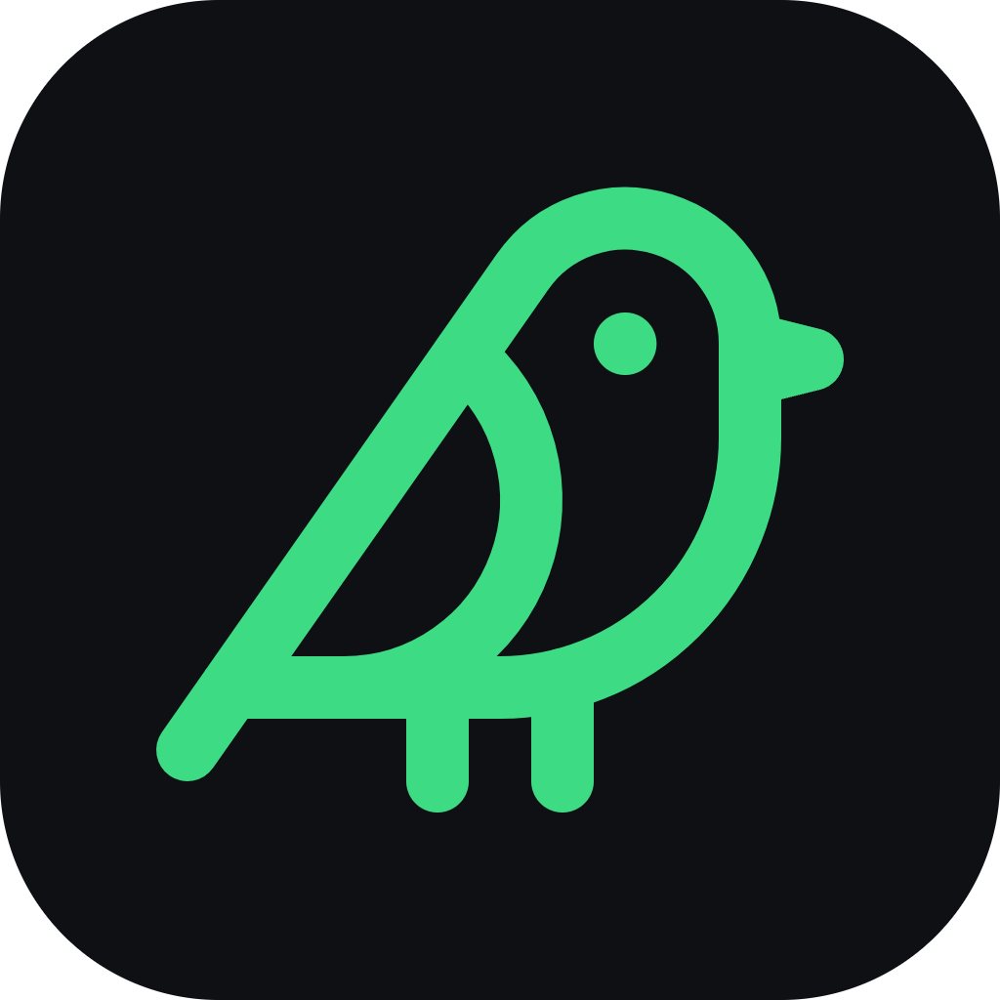

<h1 class="be-hero__title">Bird's Eye</h1>

Storage cognition for your own machine — not just <em>“what’s big?”</em> but <em>“what’s safe to delete, and why?”</em>

<strong>Everything runs locally.</strong> Nothing ever leaves your machine.

[:material-download: Download for Windows](https://github.com/keiken-shin/birds-eye/releases/latest){ .md-button .md-button--primary }
[:material-microsoft-windows: Microsoft StoreComing soon](#windows-store){ .md-button .be-soon }
[:fontawesome-brands-github: View source](https://github.com/keiken-shin/birds-eye){ .md-button }

Windows 10 &amp; 11 · x64 · free and open source (MIT) · offline

  

## Storage tools tell you what’s big. Bird’s Eye tells you what to do about it.

A disk map answers one question — *where did the space go?* Bird's Eye answers the
one that actually unblocks you: **which of this is safe to remove, and on what evidence?**

It scans your folders into a persistent on-device index, then runs an opt-in
**intelligence layer** that reasons about every folder — why it exists, whether it's
regenerable, what depends on it — and turns that into safety verdicts, reclaimable-space
estimates, and a reviewed, fully reversible cleanup flow.

No accounts. No telemetry. No upload. The index, the reasoning, and every decision stay
on your disk.

## The loop

-   :material-radar:{ .lg .middle } **Scan**

    ---

    A parallel Rust scanner walks your drive — cancellable, symlink-safe — and streams
    results into a persistent SQLite index. Rescans are incremental: unchanged files are
    skipped, so the second look is fast.

-   :material-brain:{ .lg .middle } **Understand**

    ---

    The intelligence layer classifies each folder by category, age, and purpose — build
    caches, media, installers, abandoned projects — using on-device heuristics. No ML, no
    cloud, and it shows its reasoning.

-   :material-shield-check:{ .lg .middle } **Decide**

    ---

    Every candidate carries a verdict — safe
    review
    protected
    keep — paired with its size, staleness, and
    a plain-language reason. Nothing is invented; unclassified means unclassified.

-   :material-backup-restore:{ .lg .middle } **Clean — reversibly**

    ---

    Staged items pass a review gate, then go to the OS Recycle Bin with a tracked entry —
    restorable for 30 days, or instantly via Undo. Or move a file to a better home instead
    of deleting it; the index heals itself.

## One workspace, seven lenses

There are no “pages.” A single persistent workspace holds one index, and the top-bar
switcher flips between views of it — the Inspector, Cleanup Tray, and Review gate stay
with you the whole time.

-   **Overview**

    ---

    The hub: capacity bar, category donut, top consumers, an age snapshot, and a headline —
    *“X GB can likely be freed.”*

-   **Treemap**

    ---

    A squarified space map colored by **type** or by **safety verdict**, drillable to any
    depth.

-   **Board**

    ---

    An open canvas of the investigation: findings cluster around shared-source hubs with
    labeled edges; marquee-select, group-drag, auto-arrange.

-   **Files**

    ---

    Ranked search with category filters, size/date sorting, staleness tags, and curated
    saved views like *“Large & regenerable.”*

-   **Duplicates**

    ---

    Waste-ranked groups with side-by-side previews — keep the newest, stage the rest, or
    move a copy where it belongs.

-   **Cleanup**

    ---

    Risk-labeled recommendations (safe · review · caution) with multi-select staging into
    the tray.

-   **Timeline**

    ---

    Monthly activity, file-age distribution, and *“large & untouched”* candidates.

[Tour the workspace :material-arrow-right:](guide/the-workspace.md){ .md-button }

## Safety is the default, not a setting

Bird's Eye is deliberately **anti-scareware**. It never nags, never auto-deletes, and never
pressures you toward a “clean now” button.

- **Recycle bin first, always.** Every clean goes to the OS Recycle Bin with a tracked
  entry, restorable for 30 days from *Recently cleaned* — or reverted instantly with Undo.
- **Held-back items are shown, never dropped.** If the safety predicate holds something
  back, you see it and its reason — and you can still remove it through an explicit,
  clearly-marked override.
- **The intelligence layer is opt-in per index**, heuristic, and transparent. It reasons in
  the open and never fabricates data.

[How the safety model works :material-arrow-right:](guide/working-safely.md){ .md-button }

## Private by design

Bird's Eye is an offline desktop app. There is no server to sign in to, no account to
create, and no path in the code that uploads your file paths, metadata, hashes, or
contents. Verify it yourself — [the source is MIT-licensed and public](https://github.com/keiken-shin/birds-eye).

## Get Bird's Eye

[:material-download: Download the latest release](https://github.com/keiken-shin/birds-eye/releases/latest){ .md-button .md-button--primary }
[:material-hammer-wrench: Build from source](develop/building.md){ .md-button }

### Windows Store { #windows-store }

A Microsoft Store listing — one-click install and automatic updates — is **on the way**.
Until it lands, grab the latest signed build from
[GitHub Releases](https://github.com/keiken-shin/birds-eye/releases/latest). Maintainers
can read how the Store package is built and submitted in
[Releasing](develop/releasing.md).
